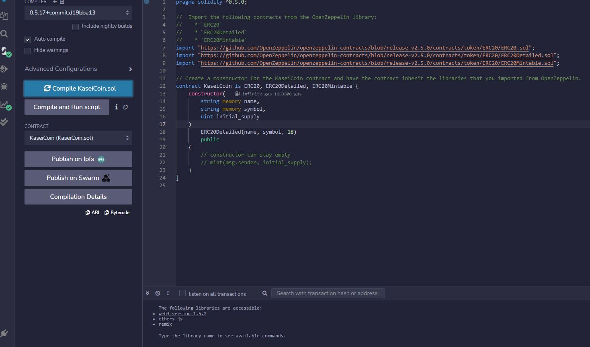
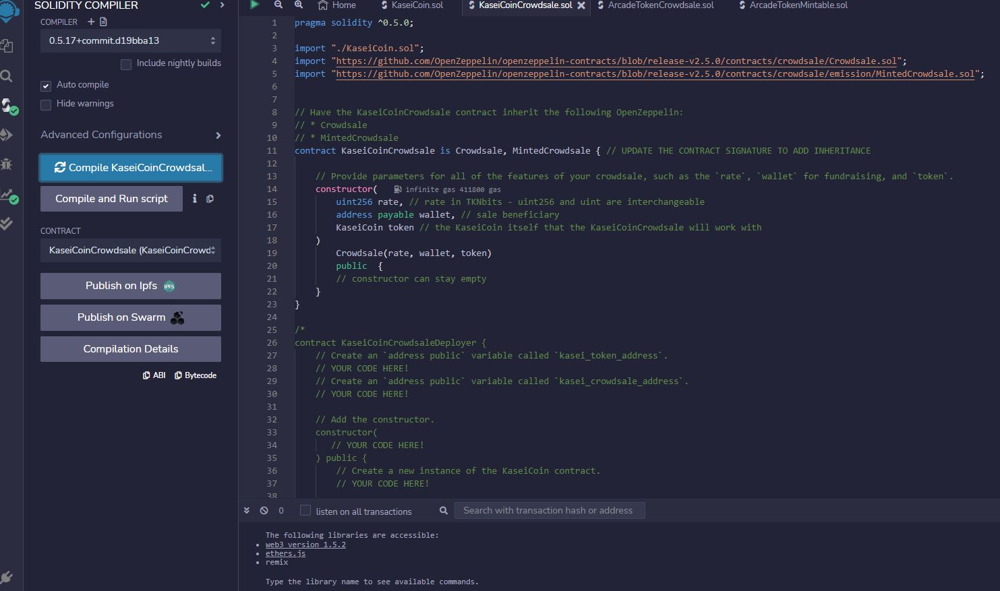
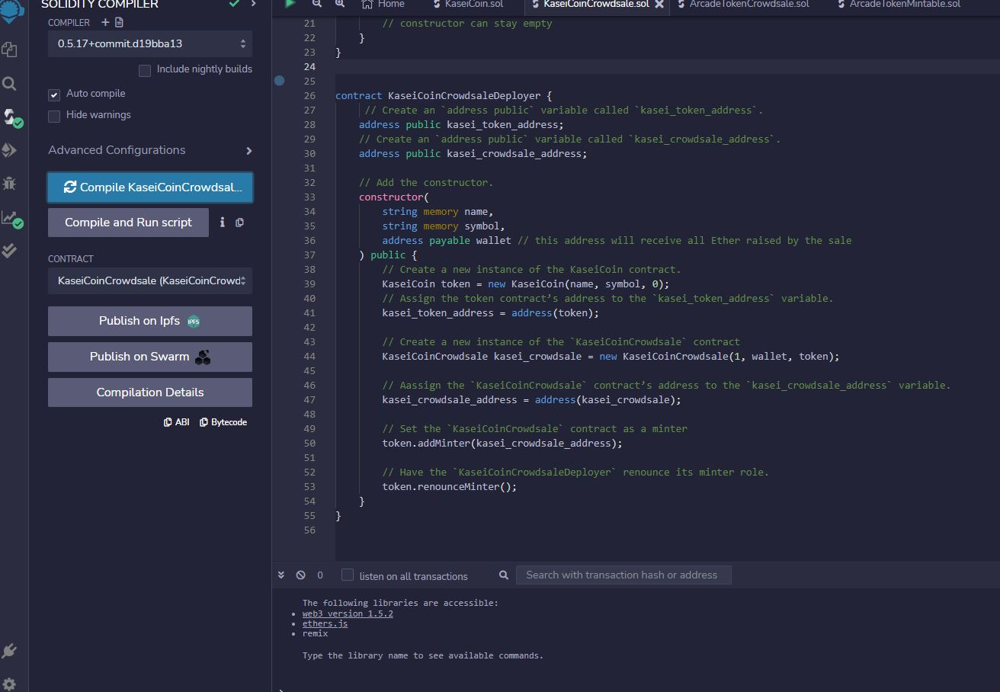
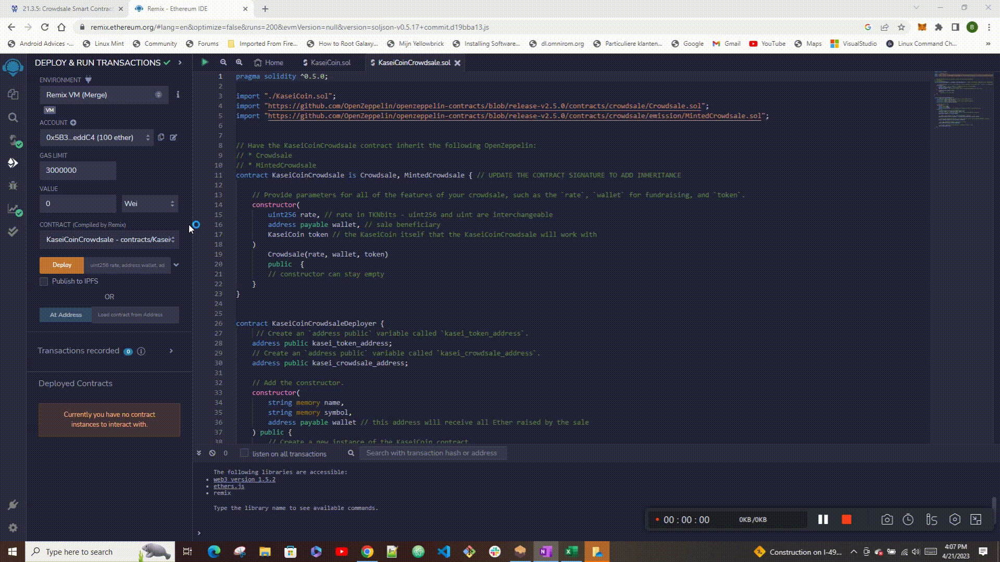
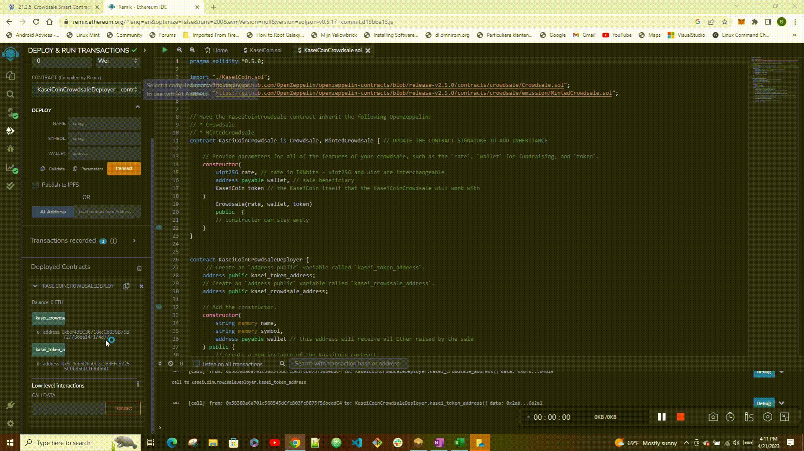
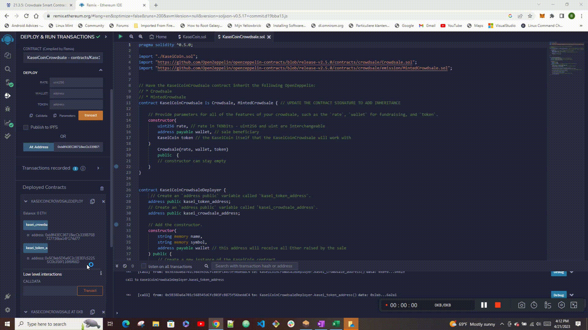

# Crowdsale

### Crowdsale application creates a fungible token that is ERC-20 compliant and that is minted by using a Crowdsale contract from the OpenZeppelin Solidity library. The crowdsale contract manages the entire crowdsale process, allowing users to send ether to the contract and in return receive KASE, or KaseiCoin tokens. The contract also mints the tokens automatically and distributes them to buyers in one transaction.

---

---

## Table of contents

1. [Technologies](#technologies)
2. [Usage](#usage)
3. [Contributors](#contributors)
4. [License](#license)

---

## Technologies

`Solidity`

_Other Software_

1. We use the `Remix IDE` to build and test the Joint Savings Account Smart Contract created with `Solidity`. Because we use the web version of this IDE, we don’t need to install any software for this module.

   - [Remix IDE](https://remix.ethereum.org/) - to initate the application.

---

## Usage

> Application summary 

The application consists of the following parts: 

- Creating the KaseiCoin token contract: 
   
- Creating the KaseiCoin crowdsale contract 
   
- Creating the KaseiCoin deployer contract 
   
- Deploying the crowdsale to a local blockchain by using Remix, MetaMask, and Ganache 

  1. In contracts select KaseiCoinCrowdsaleDeployer.sol and deploy specifying name, symbol and wallet that will be the beneficiary of the token sale. Click transact to deploy. The Deployer will create KaseiCoinCrowdsale and KaseiCoin contracts and launches them. Once launched, we need to link them in the Remix so that we can use their functions.  

  

  2. To link the Crowdsale, click the Crowdsale contract in the Deployment pane and copy the address. Then select the KaseiCoinCrowdsale contract from the contracts drop-down menu and paste the copied address in the At Address textbox to tell Remix where the contract is located. Click on At Address to make the contract available:  

  

  3. Repeat the same steps to link the KaseiCoin contract: 

  

  4.  Testing the functionality of the crowdsale by using test accounts to buy new tokens and then checking the balances associated with those account. Two Ganashe test accounts are being used - one being an owner account that mints and distributes tokens and one account that is used to purchase tokens. Tests include checking the balance of the accounts used for purchase and for minting tokens as well as the total supply of tokens:  

   

> Getting started 

- To deploy the application, first clone the repository to your PC. 
- To deploy the contracts open the cloned sol files in the Remix IDE and follow the instructions from the [Usage](#usage) section.  

---

## Contributors

Contact Details:

Boris Dudkin:

- [Email](boris.dudkin@gmail.com)
- [LinkedIn](www.linkedin.com/in/Boris-Dudkin)

---

## License

MIT

---
